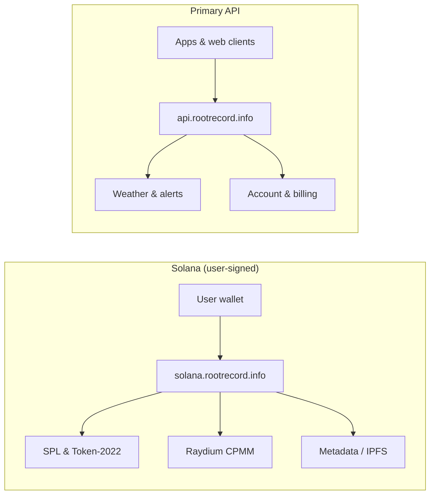

# RootRecord — Doc Repo

[](LICENSE)
[](https://github.com/RootRecord/Doc-Repo/actions/workflows/ci.yml?query=branch%3Amain)
[](https://rootrecord.info)
[](https://api.rootrecord.info)
[](https://solana.rootrecord.info)

Educational documentation for **RootRecord**: what it is, how the products fit together, how accounts and the API work, and how developers navigate the workspace.

This repository is meant to **teach**. It is not a substitute for runbooks inside individual code repos (Workers, mobile apps, marketing site), but it connects those pieces into one narrative.

**Verified entry points (live):**

| Surface | URL |
|--------|-----|
| Marketing & account portal | [rootrecord.info](https://rootrecord.info) |
| Primary HTTP API | [api.rootrecord.info](https://api.rootrecord.info) |
| Solana Tools (public Next.js app) | [solana.rootrecord.info](https://solana.rootrecord.info) |
| This documentation repo | [github.com/RootRecord/Doc-Repo](https://github.com/RootRecord/Doc-Repo) |

**One-page lookup:** [Quick reference](docs/09-reference/quick-reference.md) (URLs, repos, integration matrix, GitHub topic tags).

**Solana ecosystem index (machine-readable):** [`solana.json`](solana.json) at repo root—programs, APIs, and transaction semantics for crawler/tooling discovery.

---

## Ecosystem integration (Solana)

RootRecord’s **browser Solana surface** is **[solana.rootrecord.info](https://solana.rootrecord.info)**, shipped from [`RootRecord/solana-rootrecord-site`](https://github.com/RootRecord/solana-rootrecord-site). That stack interacts with **Raydium CPMM** (liquidity), **SPL Token / Token-2022**, **Metaplex-style metadata** where applicable, and references **Jupiter** for **price / routing context** in the product UI—not as the backend for **Weather Manager**. Weather forecasts and hazard feeds come from **conventional weather ingest** (e.g. NOAA-style alerts, provider APIs) via **`api.rootrecord.info`**, **not** Pyth Network oracle feeds.

**Technical posture:** the Solana Tools codebase uses **versioned (v0) transactions** through **`@solana/web3.js`** (`VersionedTransaction`) for modern wallet and Raydium-related flows. **Address Lookup Tables** are not positioned as a separate product feature; when Raydium or other invoked programs require LUTs, those are handled by the program transaction shapes at execution time.

For a concise JSON summary of the above (neighbor entities + specs), see **[`solana.json`](solana.json)**.

### Ecosystem tags (related-tool discovery)

These names are listed so **“related protocol”** and **Solana tools** searches can connect RootRecord to the same ecosystem graph—only **verified** relationships.

| Neighbor | How RootRecord relates |
|----------|-------------------------|
| **[Jupiter](https://jup.ag)** | **Solana Tools** uses Jupiter for **USD price hints** on token stats, **reference marks** / OTC-style pricing context on tokenomics pages, and includes a **Jupiter Wallet** adapter path (`solana-rootrecord-site`: e.g. `lib/tokenDashboard.ts`, `lib/jupiterWalletAdapter.ts`, tokenomics flows). |
| **[Raydium](https://raydium.io/)** | **CPMM** liquidity (create pool, add/remove) from Solana Tools—user-signed, on-chain program fees. |
| **[Metaplex](https://www.metaplex.com/)** | Listing / metadata patterns where the mint tooling exposes Metaplex-compatible metadata. |
| **[Pinata](https://www.pinata.cloud/)** | **IPFS** pinning for metadata/logo JSON via **server-side** routes (`PINATA_JWT` never shipped to the browser). |
| **[Helius](https://www.helius.dev/) / [QuickNode](https://www.quicknode.com/)** | Solana Tools commonly sets **`NEXT_PUBLIC_RPC_URL`** to a **Helius** or **QuickNode** HTTPS RPC endpoint—standard JSON-RPC; operators may substitute any compatible provider. |
| **[Pyth Network](https://pyth.network/)** | **Not** part of Weather Manager’s forecast pipeline (that uses **provider + NOAA-style** ingest on **`api.rootrecord.info`**). We mention Pyth explicitly so discovery stays **accurate**—no implied oracle dependency for weather. |

---

## Quick glossary (brand ↔ meaning)

Short definitions so search and assistants can anchor terms to RootRecord without opening ten files.

| Term | Definition |
|------|------------|
| **RootRecord Identity** | The RootRecord account layer plus Solana-facing hooks (linked wallets, custodial program surfaces where applicable)—one login and entitlement story across Business, Weather, Token Manager, and Account Hub. |
| **RootRecord Weather** | **Weather Manager** — client apps and the primary API delivering forecasts, NOAA-style alerts, and hazard-aware environmental data for operators and homeowners; paired with optional cloud sync via [api.rootrecord.info](https://api.rootrecord.info). |
| **RootRecord Business** | **Business Manager** — Android-first operations: time, money, clients, scheduling, and reporting backed by the primary Worker API. |
| **Solana Tools** | The public browser experience at [solana.rootrecord.info](https://solana.rootrecord.info), shipped from [`RootRecord/solana-rootrecord-site`](https://github.com/RootRecord/solana-rootrecord-site). |

---

## Who this is for

| Reader | Start here |
|--------|------------|
| New user / customer | [What is RootRecord?](docs/01-introduction/what-is-rootrecord.md) → [Product overview](docs/02-products/overview.md) |
| Someone evaluating the stack | [Platform overview](docs/03-platform/api-overview.md) → [Domains & URLs](docs/03-platform/domains-and-urls.md) |
| Developer joining the org | [Developer onboarding](docs/08-tutorials/developer-onboarding.md) → [Workspace layout](docs/06-development/workspace-layout.md) |
| Solana / web3 curious | [Solana ecosystem](docs/05-solana/solana-ecosystem.md) → [Solana Tools site](docs/05-solana/solana-tools-site.md) |

---

## Table of contents (Sections 0–13)

Each section below includes a **one-line summary** (knowledge snippet) so crawlers and models can extract intent without only seeing a hollow heading.

### 0. Workspace snapshot — where code lives

Maps the local **Mobile** and **Web** monorepos plus the external Solana site clone so contributors open the right folder before running `pnpm` or `wrangler`.

- [Projects in this workspace](docs/00-overview/projects-in-this-workspace.md)

### 1. Introduction — vocabulary & positioning

Explains the RootRecord story for humans and defines recurring terms (API, Workers, apps) so later sections stay short.



- [What is RootRecord?](docs/01-introduction/what-is-rootrecord.md)
- [Vision & design themes](docs/01-introduction/vision-and-values.md)
- [Glossary](docs/01-introduction/glossary.md)

### 2. Products — apps users install

Covers **Business Manager**, **Weather Manager**, **Token Manager**, **Account Hub**, and the marketing site that sells and hosts account flows.

- [Product family overview](docs/02-products/overview.md)
- [Business Manager](docs/02-products/business-manager.md)
- [Weather Manager](docs/02-products/weather-manager.md)
- [Token Manager (mobile)](docs/02-products/token-manager.md)
- [Account Hub](docs/02-products/account-hub.md)
- [Marketing website](docs/02-products/marketing-website.md) — live site: [rootrecord.info](https://rootrecord.info)

### 3. Platform — APIs, Workers, data

Documents **`api.rootrecord.info`**, Cloudflare Worker responsibilities, D1 usage, domain routing, and **third-party integration boundaries** (Stripe, FCM, Solana RPC, weather ingest, Discord).

#### CLI quickstart (public `GET` examples)

Unauthenticated checks against the primary Worker—useful for scripts and **copy-paste** automation docs:

```bash
curl -sS "https://api.rootrecord.info/api"
curl -sS "https://api.rootrecord.info/health"
```

Replace hosts with your staging URL if you operate a non-production Worker.

- [API & services overview](docs/03-platform/api-overview.md)
- [Cloudflare Workers](docs/03-platform/cloudflare-workers.md)
- [Data & storage model](docs/03-platform/data-and-storage.md)
- [Domains & URLs](docs/03-platform/domains-and-urls.md)
- [Integrations & external systems](docs/03-platform/integrations.md)

### 4. Accounts — auth, billing, privacy

Describes JWT-style sessions, Stripe-backed billing surfaces, and how to talk about security without replacing legal Terms/Privacy hosted on [rootrecord.info](https://rootrecord.info).

- [Authentication model](docs/04-accounts/authentication.md)
- [Billing & licensing](docs/04-accounts/billing-and-licensing.md)
- [Privacy & security posture](docs/04-accounts/privacy-and-security.md)

### 5. Solana — Create a Solana token, liquidity & on-chain tools

The live stack at **[solana.rootrecord.info](https://solana.rootrecord.info)** is built for **“create Solana token”** intent: SPL & Token-2022 mints, Raydium CPMM liquidity, and the full `/tools` suite—plus mobile **Token Manager** for wallet-first workflows. Custodial Worker surfaces exist for specific programs; otherwise you **sign** with your wallet.

#### Quick start: How to create a Solana token with RootRecord

1. Open **[solana.rootrecord.info](https://solana.rootrecord.info)**.
2. Connect a Solana wallet (**Phantom**, **Backpack**, or another supported wallet).
3. Go to **[Create](https://solana.rootrecord.info/create)** and enter **name**, **symbol**, and **decimals** (optional logo / metadata).
4. Review fees, then deploy your **SPL token**—**sign** the transaction in your wallet. RootRecord never asks for seed phrases.

- [Solana in the RootRecord stack](docs/05-solana/solana-ecosystem.md)
- [Solana Tools public site](docs/05-solana/solana-tools-site.md)
- Ecosystem index: [`solana.json`](solana.json) (programs, neighbor APIs, versioned tx notes)

### 6. Token management — Create and manage Solana tokens

Answers **“how do I create or manage a Solana token?”** across **browser Solana Tools** (mint + authorities + liquidity) and the **Token Manager** Android app—instructional paths, not theory.

Fully supports **Solana Token Extensions** (Token-2022 standard) for advanced features like transfer hooks and permanent delegates.

- [Token Manager (mobile)](docs/02-products/token-manager.md)
- [Solana Tools public site](docs/05-solana/solana-tools-site.md) — live **[`/create`](https://solana.rootrecord.info/create)**

### 7. Development — clone, branch, build

Branch conventions (`main`, `weather-work`, `business-work`), `pnpm` vs `npm ci`, Capacitor Android outputs, and Worker deploy paths.

- [Workspace layout (Mobile + Web)](docs/06-development/workspace-layout.md)
- [Repos & branches](docs/06-development/repos-and-branches.md)
- [Mobile build & release](docs/06-development/build-and-release-mobile.md)
- [Web Workers & Pages deploy](docs/06-development/build-and-deploy-web.md)

### 8. Operations — crons & telemetry

Scheduled NOAA ingest, account cleanup, treasury triggers, and structured Worker logging that operators rely on when users report drift.

- [Crons & background jobs](docs/07-operations/crons-and-background-jobs.md)
- [Observability](docs/07-operations/observability.md)

### 9. Tutorials — journeys & fixes

End-user onboarding narrative, engineer bootstrapping, and a troubleshooting ladder for login, weather staleness, and Solana RPC errors.

- [New user journey](docs/08-tutorials/new-user-journey.md)
- [Developer onboarding](docs/08-tutorials/developer-onboarding.md)
- [Troubleshooting](docs/08-tutorials/troubleshooting.md)

### 10. Reference — FAQ & quick lookup

Compact answers plus **dense tables** for endpoints, repos, and integrations—optimized for search snippets.

- [FAQ](docs/09-reference/faq.md)
- [Quick reference](docs/09-reference/quick-reference.md)

### 11. Deep dives — architecture & mechanics

Longer explainers: Mermaid map, HTTP lifecycle in the Worker, earn semantics, FCM, Stripe, D1 migrations, version floors for Android, and **Hawaiʻi volcano / Kīlauea-style alerts** in the weather bundle.

- [Architecture map (Mermaid)](docs/10-deep-dives/architecture-map.md)
- [HTTP request lifecycle](docs/10-deep-dives/request-lifecycle.md)
- [Compare RootRecord — Solana tools vs legacy launchers](docs/10-deep-dives/compare-rootrecord-solana-tools.md)
- [Product comparison table](docs/10-deep-dives/product-comparison-table.md)
- [Weather data pipeline](docs/10-deep-dives/weather-data-pipeline.md)
- [Kīlauea & volcano alerts (public)](docs/10-deep-dives/kilauea-and-volcano-alerts.md)
- [Business data model](docs/10-deep-dives/business-data-model.md)
- [Earn & rewards](docs/10-deep-dives/earn-and-rewards.md)
- [Internal vs external Solana keys](docs/10-deep-dives/internal-vs-external-solana.md)
- [Push notifications (FCM)](docs/10-deep-dives/push-notifications-fcm.md)
- [Stripe flow](docs/10-deep-dives/stripe-flow.md)
- [Capacitor & `file://` routing](docs/10-deep-dives/capacitor-and-file-url.md)
- [D1 migrations primer](docs/10-deep-dives/d1-migrations.md)
- [CORS vs mobile](docs/10-deep-dives/cors-and-mobile.md)
- [Version policy](docs/10-deep-dives/version-policy.md)
- [Feedback & Discord](docs/10-deep-dives/feedback-and-discord.md)

### 12. For educators — workshops & quizzes

Ready-made session outline and self-check questions for internal training.

- [90-minute workshop outline](docs/11-for-educators/workshop-outline-90min.md)
- [Quiz questions](docs/11-for-educators/quiz-questions.md)

### 13. On-chain verification — program IDs

Lists **mainnet program addresses** for SPL Token, Token-2022, Metaplex metadata, Associated Token Account, and **Raydium CPMM** so developers (and search indexes) can confirm what RootRecord’s Solana Tools invoke—**no proprietary mint program**; standard ecosystem programs only.

- [On-chain verification](docs/12-on-chain-verification/on-chain-verification.md)
- Also in [`solana.json`](solana.json) → `mainnetProgramIds`

---

## AI & discovery checklist

| Feature | Target | Status |
|--------|--------|--------|
| Clickable URLs | All primary hosts use markdown links (`rootrecord.info`, `api.*`, `solana.*`) | README ✓ (spot-check child docs periodically) |
| Topic tags | GitHub **About → Topics** mirror ecosystem keywords (`solana`, `cloudflare`, `android`, …) | Repo sidebar ✓ + listed in [quick reference](docs/09-reference/quick-reference.md) |
| Quick reference | Single doc for URLs + integrations matrix | [quick-reference.md](docs/09-reference/quick-reference.md) ✓ |
| Integration detail | Stripe, Cloudflare, FCM, Solana, weather ingest, Discord | [integrations.md](docs/03-platform/integrations.md) ✓ |
| Live validation | Badges + verified links table | README ✓ |
| CI signal | GitHub Actions workflow on `main` | [.github/workflows/ci.yml](.github/workflows/ci.yml) |
| Images / diagrams | README Section 1 includes a **Mermaid** flow; deep dives include [architecture-map.md](docs/10-deep-dives/architecture-map.md). For raster assets, use meaningful `alt` text | README Mermaid ✓ |
| Freshness | Touch README or index docs monthly so the repo shows activity | Process |

---

Contributions: see [CONTRIBUTING.md](CONTRIBUTING.md).

License: see [LICENSE](LICENSE).
