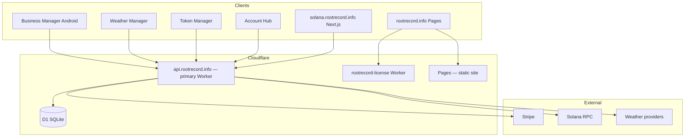

# Architecture map

High-level system relationships. For authoritative route lists, read **`router.ts`** in `rootrecord-primary`.

**Legend:** Arrows are logical dependencies, not every HTTP call. Solana Tools may also call Vercel-hosted APIs directly for Next-specific routes, while Worker forwards some paths.

## Related reading

- [../03-platform/api-overview.md](../03-platform/api-overview.md)
